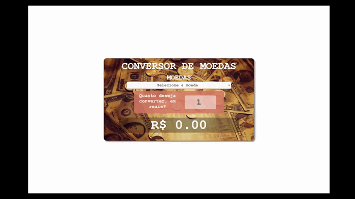

  

<h1 align="center">
 <a href="https://hailton-nascimento.github.io/CotacaoConversorMoedas/" target="_blank" rel="noopener noreferrer">Demo</a>
</h1>

# Conversor de Moeda

Este projeto é parte da Imersão Dev, realizada pela [Alura](https://www.alura.com.br/) em setembro de 2021.

## Objetivo

- Criar uma aplicação que consulte através de uma api externa a última cotação da moeda desejada e faça a conversar para reais.

# Índice

    <ul>
        <li><a href="#sobre">Sobre</a></li>
        <li><a href="#tecnologias">Tecnologias utilizadas</a></li>
    </ul>

<h2 id="sobre">
    ℹ️ Sobre
</h2>

O projeto é um conversor de moedas desenvolvido em HTML, CSS, Javascript e JQuery, além de consumir uma API de cotação de moedas (<a href="https://docs.awesomeapi.com.br/api-de-moedas">AwesomeAPI</a>) com o intuito de praticar essas competências.

---

<h2 id="tecnologias">
    🚀 Tecnologias utilizadas
</h2>

Foram utilizadas as seguintes tecnologias:

<ul>
    <li>HTML</li>
    <li>CSS</li>
    <li>Javascript</li>
    <li>JQuery</li>
</ul>

---

### Contato

- Github - [Hailton Nascimento](https://github.com/Hailton-Nascimento)
- LinkedIn - [Hailton Nascimento](https://linkedin.com/in/hailton-nascimento)

<!-- [![LinkedIn][linkedin-shield]][linkedin-url]
<!-- MARKDOWN LINKS & IMAGES -->
<!-- https://www.markdownguide.org/basic-syntax/#reference-style-links -->

<!-- [linkedin-shield]: https://img.shields.io/badge/-LinkedIn-black.svg?style=for-the-badge&logo=linkedin&colorB=555
[linkedin-url]: https://linkedin.com/in/hailton-nascimento -->

